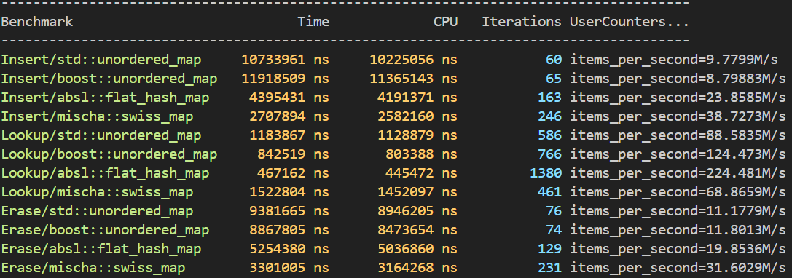

# Swiss Table
A swisse table is a fast, efficient, and cache-friendly hash table implementation in C++. It is designed to provide high performance for a wide range of applications, including those that require frequent insertions and deletions.

More of a summary of the swiss map is available at [swiss_table.md](/docs/swiss_table.md).

## Testing

To run tests, you will have to install gtest. You can do this by running the following command in your terminal:

```bash
# Ubuntu/Debian
sudo apt-get install libgtest-dev

# macOS (using Homebrew)
brew install googletest
```

Running the tests
```bash
make [test type]
# e.g.
make test
```

## Benchmarking
For benchmarking we compare our `mischa::swiss_map<K, V>` against the `std::unordered_map<K, V>`, `boost::unordered_map<K, V>`, and the implementation that this project is based off of `absl::flat_hash_map<K, V>`.

This means we need to install the two external libraries of `benchmark`, `boost` and `absl`. If you don't already have these installed, run the following commands in your terminal:
```bash
sudo apt-get install libboost-dev
sudo apt-get install libabsl-dev
sudo apt-get install libbenchmark-dev
```

The default benchmark results are here:



You can run the benchmarks for yourself using:
```bash
make benchmark_[benchmark type]
# e.g.
make benchmark_random
```
